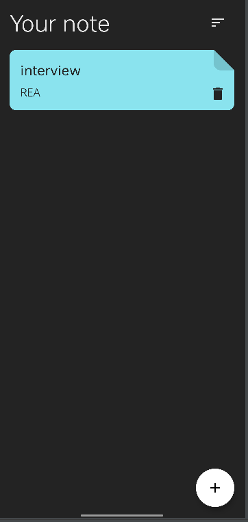
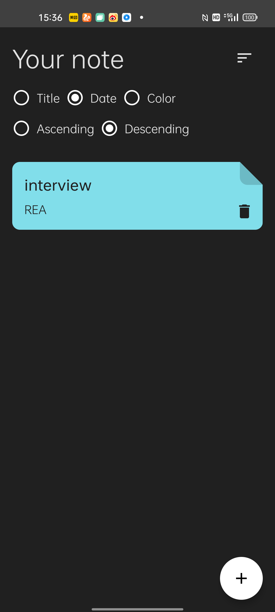
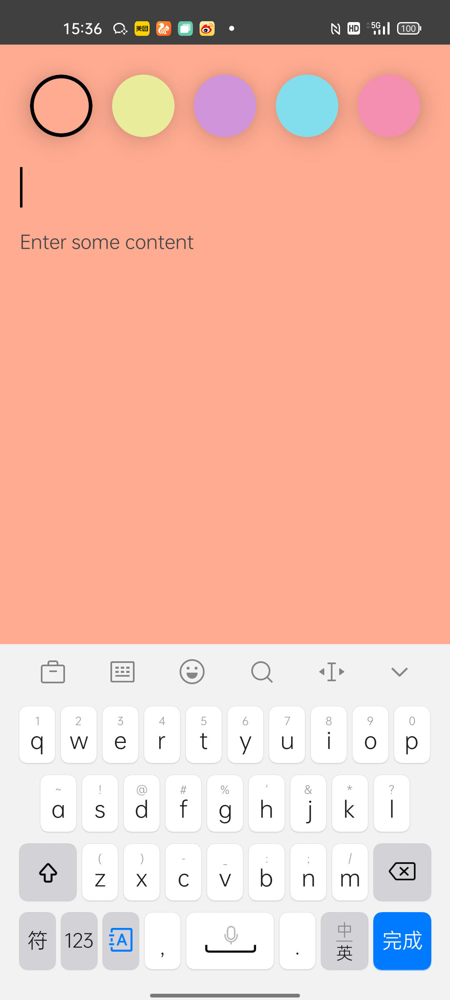

# IntergratedUseAndroidApplication
Integrate the basic technology of android application development, mainly practice three parts: MVVM architecture, commonly used jetpack, unit 

Application business function description：
1.it's a note system，support to add and edit a note
2.in app， the notes can be sorted according to certain rules（like date，title name , ect ）

Screenshot：

Technology：

1.practice the mvvm architecture again
2.practice to use compose
3.practice to use other jetpack, include Hilt&Dagger,viewModel, room
4.practice to use unit Testing

Some problems are recorded as follows：

1,push local code to github
  * git init
  * git add -A
  * git commit -m "xxx"
  * git remote add origin  xxx(remote git address)
  * git push origin master -f 
  
 Note:push will may fail  because of merge conflicts：
    * git push origin master --allow-unrelated-histories
    * git push origin master 
